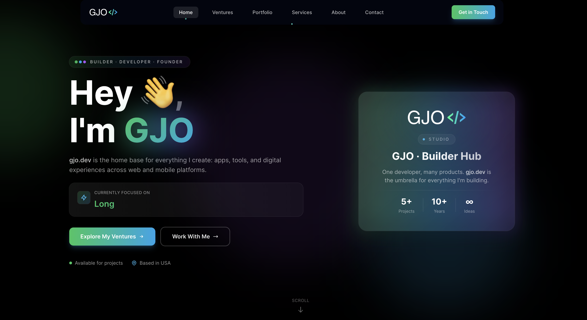

# GJO DEV STUDIO Portfolio Website


## Overview

Welcome to the official repository for my portfolio website. Built with Next.js 16 and TypeScript, this platform showcases my professional journey as a full-stack developer, highlighting my ventures, projects, skills, and services across web, mobile, and AI platforms.

**Live Site:** [gjo.dev](https://www.gjo.dev) &nbsp;·&nbsp; **Version:** `v0.2.0`

---

## Preview



---

## Technologies Used

### Core Framework
- **Next.js 16.2.6** — React framework with App Router
- **TypeScript** — Type-safe development
- **React 19** — Latest React features

### Styling & UI
- **Tailwind CSS 4.3** — Utility-first CSS framework
- **Shadcn/ui** — Component primitives
- **Custom Animations** — Smooth transitions and effects
- **Responsive Design** — Mobile-first approach

### Tools & Libraries
- **React Icons** — Icon library
- **Font Awesome** — Additional icons
- **Formspree** — Contact form handling
- **Next.js Image** — Optimized image loading
- **Vercel Analytics + Speed Insights** — Performance monitoring

---

## Features

### Pages & Sections

**Home**
- Hero section with animated background
- Tech stack carousel with infinite scroll
- Featured ventures preview
- Services overview

**Ventures**
- Grid view of all ventures (LumoraVerse, Jayobe, GJO Studio, NautiTrail, Secrts)
- Dynamic detail pages with tech stack and status
- Related ventures section

**Portfolio**
- Filterable project grid (Web Development, Experiment)
- Project detail pages with live demos and GitHub links
- Technology tags and related projects

**Services**
- Web, Mobile, UI/UX, and Consulting offerings
- Pricing and process breakdown

**About**
- Personal story, skills, experience timeline, and values

**Contact**
- Working contact form via Formspree
- Social links and FAQ

**404**
- Custom not-found page with terminal aesthetic and branded navigation

---

## Design System

- **Dark Theme** — Gray-950 base with green/sky/purple accent gradients
- **Glassmorphism Cards** — `from-white/[0.08] to-white/[0.02]` with `ring-1 ring-white/10`
- **Gradient Text** — `from-green-400 via-sky-400 to-purple-400`
- **Animated Blobs** — Pulsing gradient orbs via `animate-pulse-glow`
- **Hover States** — Scale, ring, and shimmer feedback on all interactive elements

---

## Getting Started

```bash
# Install dependencies
npm install

# Run dev server
npm run dev

# Build for production
npm run build

# Lint
npm run lint
```

---

## Project Structure

```
app/                  # Next.js App Router pages and layouts
  layout.tsx          # Root layout with metadata and global providers
  not-found.tsx       # Custom 404 page
  page.tsx            # Home page
  about/
  contact/
  portfolio/
  services/
  ventures/
components/
  home/               # Home page sections
  layout/             # Navbar, Footer
  ui/                 # Shared UI primitives
  ventures/
data/
  projects.ts         # Project entries and helpers
  services.ts         # Services data
  ventures.ts         # Venture entries
public/
  images/             # Project and logo images
```

---

## Ventures

| Venture | Status | Link |
|---|---|---|
| LumoraVerse | Active development | [lumoraverse.com](https://www.lumoraverse.com) |
| Jayobe | Active development · Beta | [jayobe.io](https://www.jayobe.io) |
| GJO Dev Studio | Active | — |
| NautiTrail | Concept / early build | [nautitrail.com](https://www.nautitrail.com) |
| Secrts | Concept / early build | [secrts.com](https://secrts.com) |

---

## Key Routes

| Route | Description |
|---|---|
| `/` | Home |
| `/about` | About me |
| `/ventures` | All ventures |
| `/ventures/[slug]` | Venture detail |
| `/portfolio` | Project grid |
| `/portfolio/[slug]` | Project detail |
| `/services` | Services |
| `/services/[slug]` | Service detail |
| `/contact` | Contact form |

---

## Links

- **Website:** [gjo.dev](https://www.gjo.dev)
- **GitHub:** [@Gorvok](https://www.github.com/Gorvok)
- **LinkedIn:** [gjovanigorvokaj](https://www.linkedin.com/in/gjovanigorvokaj/)
- **Email:** hello@gjo.dev

---

## Changelog

See [CHANGELOG.md](./CHANGELOG.md) for full version history.

---

## License

MIT License — see [LICENSE](./LICENSE) for details.

---

Made with care by [GJO](https://github.com/Gorvok)
